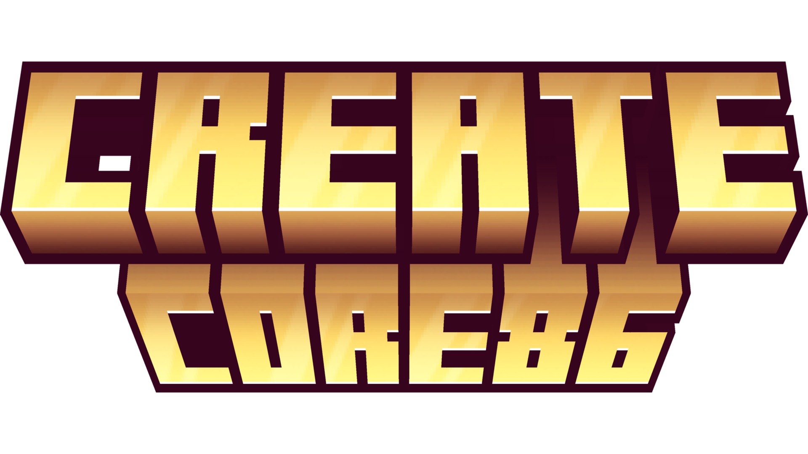

<h1 align="center">CORE86</h1>
<p align="center">Industrial reactor engineering for Minecraft 1.20.1 (Forge)</p>

## About
CORE86 is a technical mod focused on reactor operations, steam power flow, and accident management.
The design direction is "operator realism":
you build physical reactor layouts, run tests from a console, manage control rods and coolant, and handle the consequences of mistakes.

Current development is centered on the RBMK-inspired reactor line:
- fuel / graphite / control / steam channel structure scanning
- dynamic rod drive and SCRAM behavior
- xenon poisoning and experiment mode
- staged meltdown with persistent invisible radiation zones

## Features
- Multi-block reactor validation and channel mapping
- Unified reactor console with manual and grouped rod control
- AZ-5 / SCRAM logic with drive-state constraints
- Xenon poisoning telemetry in reactor UI
- Steam production pipeline for turbine-side integration
- Post-meltdown radiation model with dose accumulation
- Dosimeter item and debug command (`/core86 radiation info`)

## Installation
1. Install Minecraft `1.20.1` and Forge `47.x`.
2. Drop the built `core86` jar into your `mods` folder.
3. Start the game and create a world.

## Development
### Requirements
- JDK 17
- Git

### Setup
1. Clone the repository.
2. Open the project root in IntelliJ IDEA.
3. Run:
```bash
./gradlew genIntellijRuns
```
4. Use the generated `Minecraft Client` run configuration.

### Build
```bash
./gradlew build
```
Built jars are generated in `build/libs`.

## Asset Workflow
To keep art clean and avoid folder noise:
- Blockbench source files live in `art/blockbench/`
- Runtime block textures live in `src/main/resources/assets/core86/textures/block/`
- Runtime item textures live in `src/main/resources/assets/core86/textures/item/`

Suggested working pattern:
1. Keep editable sources in `art/blockbench/blocks/...` and `art/blockbench/items/...`
2. Export only final PNGs to `src/main/resources/assets/core86/textures/...`

## Project Status
This project is actively iterating and balance values are still in flux.
Expect frequent changes to:
- reactor thermal constants
- control rod timing
- experiment-mode risk curve
- radiation tuning

## Contributing
Issues and pull requests are welcome.
When reporting bugs, include:
- exact game version
- forge version
- mod list
- reproduction steps
- latest log snippet

## Credits
- Built on Minecraft Forge MDK
- Gameplay direction inspired by large Create-adjacent engineering mods and simulation-first mod design
